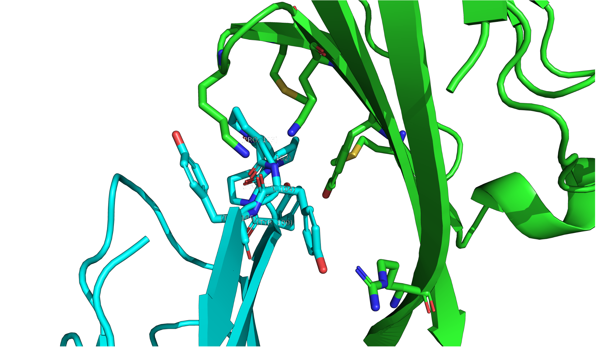
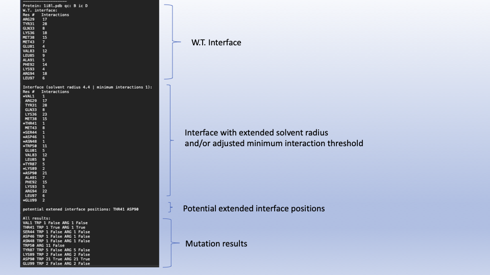

### Interface Extention
<p align="center">
  
</p>
<br>
 
### Overview:

This program uses Intercaat (https://pubmed.ncbi.nlm.nih.gov/34499117/) to identify pharmacologically relevent residues at the perirephary of the strictly defined interface. This is accomplished by defining the 'wt interface', expanding that interface by modulating the minimum interaction cutoff and/or the solvent radius, mutating the expanded positions to larger mutants (ASP and TRP by defualt) and finally assesing whether the mutant reaches the "wt interface" threshold.


### Installation and Depndencies:
* Requires python 3.6 or later. Tested on python 3.9
* Requires Anocanda to install Modeller easily. I recommend MiniConda. https://docs.conda.io/en/latest/miniconda.html
1. Clone repo:
```sh
   git clone https://github.com/eved1018/InterfaceExtention
```
2. Download Modeller: https://salilab.org/modeller/download_installation.html
    * for Conda enviroment:
```sh 
        conda config --add channels salilab
        conda install modeller
```
3. Download python dependencies (pyhull, scipy, numpy):
```sh
    pip install -r requirements.txt 
```
4. Download SCRWL4 (optional): http://dunbrack.fccc.edu/lab/scwrl


### Usage:
1. Move to repo:
```sh
cd InterfaceExtention
```
2. Run code:
```sh
python main.py 
```
### Command Line Arguments:
* -pdb: RCSB PDB id, if not provided you will be prompted to select one. If it is is in the input/ folder it will be used. Otherwise it will be downloaded from the RCSB.  
* -qc: Query chain to find extended positions on.
* -ic: partner chain.
* -sr: solvent radius for extention (default 4.4).
* -mi: Interaction cutoff for extention (default 1).
* -m: Amino Acids used for extention (default TRP,ARG).
* -r: Output file name. 
<br/>
---- 
Add these flags to use Scrwl4 or qhull.

* -s: Use scrwl4 to remodel sidechain (default no sidechain remodeling).
* -qh: Use c++ qhull (default pyhull). 

### Output:



### Notes:
* Intercaat may not understand pdbs with insertion codes use pdb-tools fixinsert function to refromat the pdb. (https://github.com/haddocking/pdb-tools)
* for extended mutants argument(-m) please use upper case three letter amino acid name seperated by a comma without spaces.


Written by Evan Edelstein
<br />
Please report any questions or complaints to steve.grudman@einsteinmed.org

<br />
<br />
<div id="Footer"></div>

[![MIT License][license-shield]][license-url]
[![LinkedIn][linkedin-shield]][linkedin-url]


<!-- MARKDOWN LINKS & IMAGES -->
<!-- https://www.markdownguide.org/basic-syntax/#reference-style-links -->
[license-url]: https://github.com/othneildrew/Best-README-Template/blob/master/LICENSE.txt
[linkedin-shield]: https://img.shields.io/badge/-LinkedIn-black.svg?style=for-the-badge&logo=linkedin&colorB=555
[linkedin-url]: https://www.linkedin.com/in/evan-edelstein/
[license-shield]: https://img.shields.io/github/license/othneildrew/Best-README-Template.svg?style=for-the-badge
[product-screenshot]: Media/ctla4cd80.png